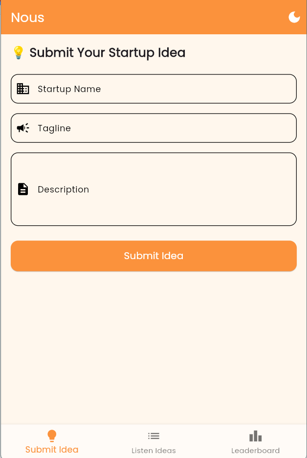
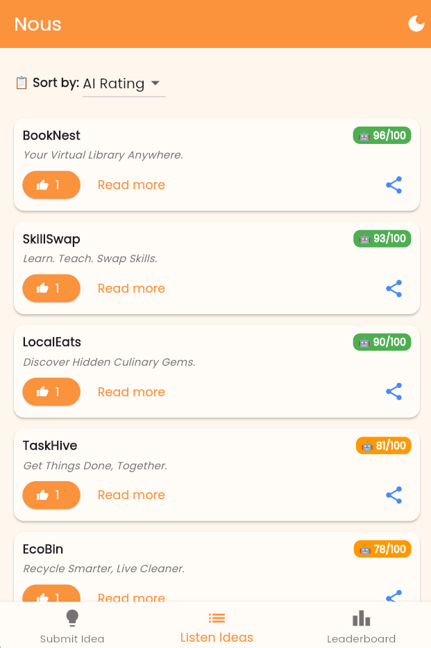
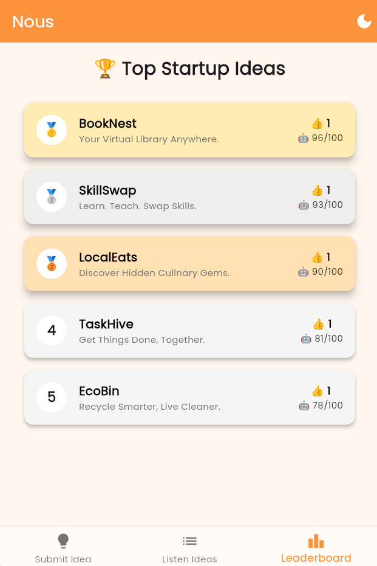

# Nous 🚀 – Startup Idea Evaluator

## 📌 Description
**Nous** is a mobile application where users can submit their startup ideas, receive a fun AI-generated rating, vote on others’ ideas, and see a leaderboard of top ideas. The app includes dark mode, swipe gestures, and a smooth, interactive UI.  

---

## 🧠 Problem Statement
Users can:  
✅ Submit their startup ideas  
⚙️ Get a fake AI-generated feedback rating  
👍 Vote on others’ ideas (one vote per idea)  
🏆 See a leaderboard of top ideas  

---

## 🧱 Features

### 1. Idea Submission Screen
- Form Fields: Startup Name, Tagline, Description  
- On submit:
  - Generate a fake AI rating (0–100)
  - Save the idea locally using **SharedPreferences**
  - Navigate to Idea Listing screen  

### 2. Idea Listing Screen
- Display all submitted ideas with:
  - Name, tagline, rating, vote count
  - “Upvote” button (one vote per idea)
  - “Read more” option to expand full description
  - Sort options: by rating or votes
- Swipe gestures to delete ideas  

### 3. Leaderboard Screen
- Show top 5 ideas (based on votes or ratings)
- Cool UI elements:
  - 🥇🥈🥉 badges
  - Gradient/shadow cards
 

### 4. Bonus Features
- Dark mode toggle  
- Toast notifications (on submission or voting)  
- Share ideas via social apps or clipboard  
- Custom fonts and icons  

---

## 🖼 Screenshots

### Idea Submission Screen

### Idea Listing Screen

### Leaderboard Screen

---

## 🎥 Video Walkthrough
Check out a quick 2–3 min demo of the app:  
  

---

## 🧑‍💻 Tech Stack
- **Flutter (Dart)**  
- Persistent storage: **SharedPreferences**  
- UI: Material widgets  
- Animations: Fade, Scale, Slide  
- Packages: `flutter_slidable`, `share_plus`, `google_fonts`  

---

## 🚀 How to Run Locally
Clone the repo:
git clone https://github.com/RohitManvar/nous.git

Navigate to project folder:
cd nous

Get dependencies:
flutter pub get

Run the app:
flutter run

